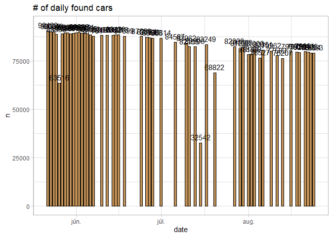

EDA
================
Marcell P. Granát

## Number of found cars per day

``` r
available_cars <- tibble(file_name = list.files("c:/rprojects/hasznaltauto/data/available_cars/")) %>% 
  transmute(
    date = str_remove_all(file_name, "available_cars_|.RDS"),
    date = as.Date(date), 
    df = map(file_name, ~ readRDS(str_c("c:/rprojects/hasznaltauto/data/available_cars/", .))),
    ) %>% 
  unnest(df) %>% 
  distinct()
```

``` r
available_cars %>% 
  count(date) %>% 
  ggplot(aes(date, n)) +
  geom_col() + 
  geom_text(aes(date, n, label = n), nudge_y = 3000) + 
  labs(title = "# of daily found cars")
```

<!-- -->

``` r
cars_lifetime <- available_cars %>% 
  arrange(date) %>% 
  group_by(url_to_car) %>% 
  summarise(start = min(date), until = max(date)) %>% 
  ungroup() %>% 
  mutate(
    selling_type = case_when(
      start == until ~ "mayfly (probably not transaction)", 
      start == min(start) & until == max(until) ~ "still alive",
      start != min(start) & until == max(until) ~ "new comer",
      start == min(start) & until != max(until) ~ "already sold",
      start != min(start) & until != max(until) ~ "well-known",
      T ~ "uncategorised"
    )
  )
```

``` r
cars_lifetime %>% 
  count(selling_type) %>% 
  knitr::kable(caption = "Number of cars by selling type")
```

| selling\_type                     |      n |
|:----------------------------------|-------:|
| already sold                      |  69354 |
| mayfly (probably not transaction) |  28002 |
| new comer                         |  53365 |
| still alive                       |  20296 |
| well-known                        | 147849 |

Number of cars by selling type
